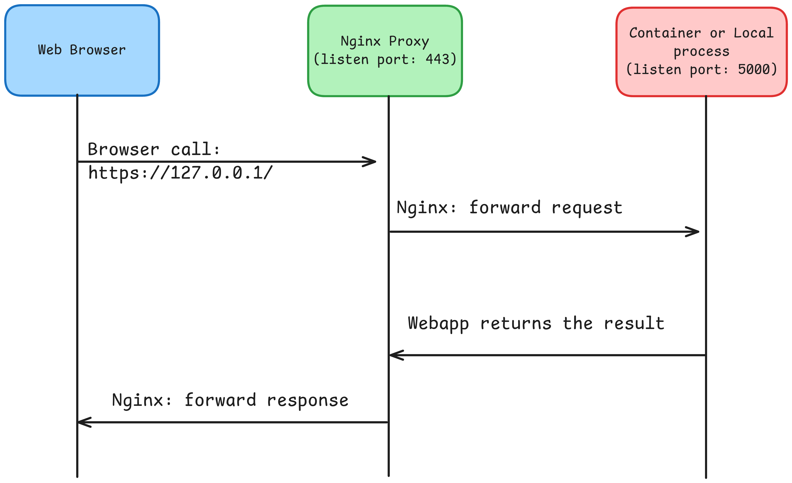

# mkcert-custom-ca
Sample scripts to use mkcert command defining custom CA externally


## Connectivity



## Usage

### generate certs
```
bash ./create-local-certs.sh
```

### run nginx
```
docker compose up
```